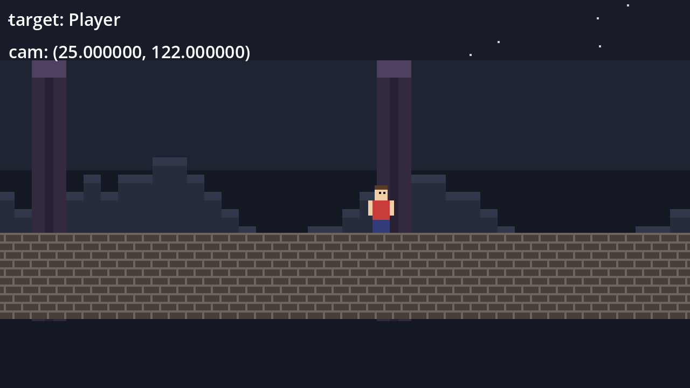

# Godot Pixel Perfect Camera

A Camera2D that follows a target smoothly, at low resolution, with no jitter and no
blur. Godot 4.7.



Every claim in this repo was measured against the working project in `godot/`, not
copied from a tutorial. Several parts contradict the setup you will find in most
existing projects, and in one place the official Godot docs. Where they do, the
measurement is shown.

## How it works

The game renders at 320x180 into a SubViewport that is **322x182** — one pixel bigger
on every side. The container sits at offset `-1, -1`, so that extra ring is off screen.

Every physics tick the camera does two things.

1. **Round once.** Everything it does — follow, shake, anything else — feeds one float
   position that is rounded to a whole pixel exactly once.
2. **Spend the slack.** A four-line shader slides the whole finished picture back by
   the fraction that rounding threw away. The slack is the room it slides into.

The camera hops in whole pixels. The shader hides the hop. Sprites stay crisp.

## The five bugs

Present in nearly every implementation you will find. Check these first when a
pixel-art camera feels wrong.

| # | Bug | Symptom | Fix |
|---|---|---|---|
| 1 | `viewport` stretch with a doubled base viewport | world judders; 2 of 4 sub-pixel steps reach the screen | base = game size, `canvas_items`, container scale 1 |
| 2 | Pixel snapping on the **root** viewport | rounds away the shader offset | off in project settings, on the SubViewport node |
| 3 | Camera in `_process` | the followed character steps **backwards** on ~1 frame in 6 on a high-refresh screen | `_physics_process` |
| 4 | Shake written to `Camera2D.offset` | shake looks mushy, sprites shift against each other | fold shake in before the round; `offset` stays zero |
| 5 | Window left resizable | a tiling WM resizes it, integer scaling collapses 4x to 1x | `window/size/resizable=false` |

Bug 1 makes the world judder. Bug 3 makes the character judder against the world.
Those are the two you feel.

## Run it

Needs Godot 4.7 or newer.

```sh
cd godot
godot                                 # play
godot --headless tests/verify.tscn    # 29 assertions, exit 0 = pass
godot tests/diagnose.tscn             # measure sub-pixel steps per game pixel
godot --headless tests/motion.tscn    # measure the followed sprite's stepping
godot tests/fps.tscn -- screen=0      # real frame rate, per monitor
godot tests/screenshot.tscn           # write user://screenshot.png
```

Controls: `A`/`D` or arrows to move, `Space`/`W` to jump, `E` to shake. Walk into a
yellow marker box and the camera parks on the marker.

Every GDScript warning that matters is set to **error**, including
`untyped_declaration`, `inferred_declaration` and all four `unsafe_*` checks. The
project refuses to run if one fires.

## Read it

- **[godot-pixel-camera/SKILL.md](godot-pixel-camera/SKILL.md)** — the whole technique in 190 lines. Start here.
- [godot-pixel-camera/reference/camera.md](godot-pixel-camera/reference/camera.md) — full camera script, camera
  triggers, shake, time effects, the autoload pattern, UI placement.
- [godot-pixel-camera/reference/traps.md](godot-pixel-camera/reference/traps.md) — snapping, physics
  interpolation, tiling window managers, frame rate on multi-monitor Wayland, and the
  measurements behind every claim.
- [godot-pixel-camera/reference/verify.md](godot-pixel-camera/reference/verify.md) — strict typing settings and
  the full test harness.

## Use it as an Agent Skill

`godot-pixel-camera/` follows the [Agent Skills](https://agentskills.io/specification)
standard. Link it into whichever agent you use:

```sh
ln -s "$PWD/godot-pixel-camera" ~/.claude/skills/godot-pixel-camera   # Claude Code
ln -s "$PWD/godot-pixel-camera" ~/.pi/agent/skills/godot-pixel-camera # pi
ln -s "$PWD/godot-pixel-camera" ~/.agents/skills/godot-pixel-camera   # shared
```

It then fires on its own when you work on a Godot pixel-art camera. Only the 190-line
`SKILL.md` sits in context; the reference files load on demand.

It is also just markdown. Read it directly if you would rather not install anything.

## License

MIT. See [LICENSE](LICENSE). The sprites in `godot/sprites/` are generated
placeholders and carry the same license.
